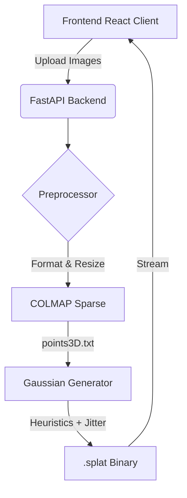

# Neural Reconstruction Studio (3DGS)

A lightweight, scalable pipeline for generating high-quality 3D Gaussian Splats from unstructured image collections. This repository handles end-to-end processing: ingestion, preprocessing, structure-from-motion (COLMAP), heuristic Gaussian conversion, and real-time web rendering.

## Architecture



## Features

- **Real-Time Splat Rendering:** Uses `@react-three/drei` and `@react-three/postprocessing` for high-FPS, browser-native neural rendering.
- **Cinematic Viewer:** Auto-centering, cinematic bloom/vignette, and smooth damping.
- **Lightweight Backend:** Bypasses heavy CUDA/PyTorch dependencies by utilizing a heuristic Gaussian generator from COLMAP sparse data.
- **Production Safety:** Includes upload validation, strict session isolation, and an automatic 24-hour cleanup cron-task.

## Getting Started

### Backend Setup (Python)

1. Navigate to the backend directory:
   ```bash
   cd backend
   ```
2. Install dependencies:
   ```bash
   pip install -r requirements.txt
   ```
3. Install COLMAP (required on PATH):
   - Windows: Download binaries and add to PATH.
   - Linux: `sudo apt-get install colmap`
4. Start the server:
   ```bash
   python -m uvicorn api.main:app --host 127.0.0.1 --port 8001
   ```

### Frontend Setup (Next.js)

1. Navigate to the frontend directory:
   ```bash
   cd frontend
   ```
2. Install dependencies:
   ```bash
   npm install
   ```
3. Configure environment variable in `.env.local`:
   ```env
   NEXT_PUBLIC_API_URL=http://127.0.0.1:8001/api/v1
   ```
4. Start the dev server:
   ```bash
   npm run dev
   ```

## Cloud Deployment

### Vercel (Frontend)
Simply import the `frontend` directory as a new Vercel project. Ensure you set the `NEXT_PUBLIC_API_URL` environment variable to point to your deployed backend URL.

### Render / RunPod (Backend)
Use the included `Dockerfile`. Note that `colmap` is installed via `apt-get` in the Dockerfile, which works for Debian-based containers.
Make sure to expose Port `8000`.

## Exporting
The completed pipeline allows you to download the `.splat` file directly from the web interface for use in Unreal Engine, Unity, or Luma WebGL.
